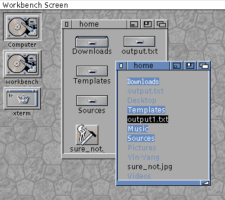
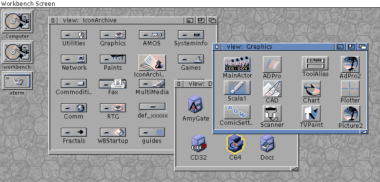

# amiwm
Amiga Workbench inspired window manager for Xorg..

This repo aims at implementing some missing features of Amiwm as it currently stands,
resume its development, and bring a more complete Amiga desktop experience to Linux.
In time, missing gadgets will be implemented, such as sliders, and other types of buttons.

It's a work in progress and i just got started but so far there's the first steps toward a file manager, 
there also a replica of the ASL requester, an icon viewer and some more general fixes and updates.

<div align="center">
<table>
<tr>
  <td style="vertical-align:top"></td>
  <td style="vertical-align:top"></td>
</tr>
<tr>
  <td colspan=2 style="vertical-align:top"></td>
</tr>
</div>


## Getting started
Before compiling, make sure that you have following packages installed:

```
gcc make autoconf xorg xorg-xinit xorg-dev
```

First, run configuration script:

```
./configure
```

After that, you can either edit the Makefile, or leave it as is. After that, compile and install amiwm using

```
make
sudo make install
```

Hopefully, your compilation was succesfull - now you should have amiwm installed!

## Launching amiwm
To launch amiwm, use

```
startx amiwm
```

Or add "amiwm" to your xinitrc file

## Configuration
Configuration utility is not yet available; To configure amiwm, you'll need
to create and edit .amiwmrc file in your home directory. To do so, read
amiwm's manpage.


## Development
To work on amiwm from within another desktop, use xephyr and
start amiwm with display environment variable to redirect amiwm to 
start on xephyr session instead of replacing your own desktop wm.
```
Xephyr -br -ac -noreset -no-host-grab -screen 800x600 :1 &
DISPLAY=:1 amiwm
```

## Authors
Originally created by **Marcus Comstedt**;
Contributions by
* Scott Lawrence
* Nicolas Sipieter

## Previous repositories
Previously, amiwm was using bzr instead of git; The bzr repository can be found [here](http://mc.pp.se/bzr/amiwm/)
## License
This project is published under a custom license - see [LICENSE.md](LICENSE.md) for details.

Amiga, AmigaOS and Workbench are registered trademarks of AMIGA International Inc.
